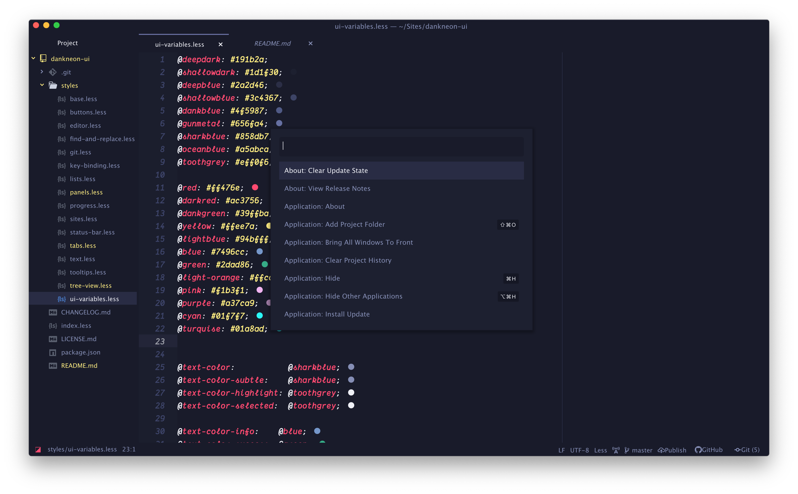

# Dankneon UI

This is the corresponding Atom-UI theme to the syntax theme from [dankneon.com](https://dankneon.com), which is available [here](https://github.com/DankNeon/atom).

# Installation
Fire up your Terminal and type

`apm install dankneon-ui`

Or, inside Atom's Settings page select Install and search for *dankneon-ui* Theme.

# Feedback
Are you enjoying the Dankneon theme? Let us know, also don't hesitate letting us know if you run into bugs or if you have ideas to make it better. 😉
